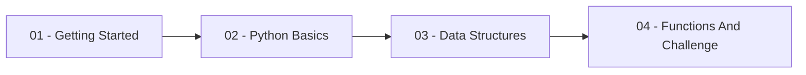

# Python Basics

This repository is a notebook-based learning path for building a solid
foundation in [Python](https://docs.python.org/3/tutorial/). The notebooks
begin with the [VS Code Jupyter Notebook](https://code.visualstudio.com/docs/datascience/jupyter-notebooks)
workflow and readable code conventions, then progress through core syntax,
data structures, comprehensions, and reusable functions.

Follow the notebooks in numerical order. Each notebook is designed to be
executed interactively and includes practice tasks that build toward the final
functions challenge.

## Learning Path



### 01 - Getting Started

- [Intro to Jupyter Notebook](./1_Getting_Started/Intro_to_Jupyter_Notebook.ipynb):
  Open notebooks in VS Code, select a kernel, execute cells, work with
  Markdown, and use notebook tooling.
- [Coding Best Practices](./1_Getting_Started/Coding_best_practices.ipynb):
  Apply readable naming, whitespace, and formatting practices based on
  [PEP 8](https://peps.python.org/pep-0008/).

### 02 - Python Basics

- [Numeric Variable Types](./2_Basics/1_Numeric_Variable_Types.ipynb):
  Work with variables, numeric data types, operators, and type conversion.
- [Strings](./2_Basics/2_Strings.ipynb): Create, combine, index, and iterate
  through text values.
- [If Statements](./2_Basics/3_If_Statements.ipynb): Express conditional logic
  with `if`, `elif`, and `else`.
- [Loops](./2_Basics/4_Loops.ipynb): Repeat operations with `for` and `while`
  loops and control their execution.

### 03 - Data Structures

- [Lists](./3_Data_Structures/1_Lists.ipynb): Store, modify, index, and
  iterate through ordered collections.
- [Tuples](./3_Data_Structures/2_Tuples.ipynb): Understand immutable sequences
  and compare them with lists.
- [Dictionaries](./3_Data_Structures/3_Dictionaries.ipynb): Map keys to
  values and work with dictionary methods.
- [Sets](./3_Data_Structures/4_Sets.ipynb): Store unique values and perform
  set operations.
- [Comprehensions](./3_Data_Structures/5_Comprehension.ipynb): Construct
  lists and dictionaries concisely from iterables.

### 04 - Functions And Challenge

- [Introduction to Functions](./4_Functions/1_Introduction_to_Functions.ipynb):
  Understand why functions are useful and define simple reusable operations.
- [Function Definitions](./4_Functions/2_Function_Definitions.ipynb): Work
  with parameters, annotations, defaults, and multiple arguments.
- [Calling Functions](./4_Functions/3_Calling_Functions.ipynb): Use
  positional and keyword arguments correctly.
- [Function Challenge](./4_Functions/4_Challenge.ipynb): Apply the unit's
  concepts in progressive practice tasks.

## Repository Map

```text
ds-python-basics/
|-- 1_Getting_Started/      # VS Code notebooks and readable-code conventions
|-- 2_Basics/               # variables, strings, conditions, and loops
|-- 3_Data_Structures/      # collections and comprehensions
|-- 4_Functions/            # functions and the final challenge
|-- images/                 # local screenshots used in the notebook intro
|-- .python-version         # Python 3.13 selection
|-- pyproject.toml          # project dependencies
`-- uv.lock                 # reproducible dependency lockfile
```

## Environment

### 1. Create the Repository from the Template

Click **Use this template** on GitHub.

When creating the repository:

- Set yourself as the **Owner**
- Choose a repository name
- Enable **Include all branches**
- Click **Create repository**

> [!IMPORTANT]
> If you are working in pairs or groups, only **one person** should complete this step.

---

### 2. Add Collaborators (Pairs/Groups Only)

If you are working with teammates:

1. Open the repository on GitHub
2. Go to **Settings -> Collaborators**
3. Add your teammates as collaborators
4. Share the repository link with your team (they must accept the GitHub invitation)

---

### 3. Clone the Repository

Copy the SSH URL from the **Code** button on GitHub, then run:

```bash
git clone <copied-ssh-url>
```

---

### 4. Move into the Project Folder and Install Dependencies

This installs all dependencies and creates the virtual environment (`.venv/`).

```bash
cd ds-python-basics
uv sync
```

---

### 5. Activate the Virtual Environment

#### macOS / Linux

```bash
source .venv/bin/activate
```

#### Windows (PowerShell)

```powershell
.venv\Scripts\Activate.ps1
```

#### Windows (Git Bash)

```bash
source .venv/Scripts/activate
```
### 6. Open the Notebooks

Recommended: open the VS Code in your current terminal folder.

```bash
code .
```

Then open a notebook and select the Python environment created by `uv sync` as the kernel.

Alternatively, you can start JupyterLab in the browser:

```bash
uv run jupyter lab
```

## Learning Objectives

By the end of this repository, you should be able to:

- Work productively with Jupyter notebooks in VS Code.
- Write readable Python code using clear naming and formatting conventions.
- Use variables, numeric operators, strings, conditional statements, and loops.
- Choose and manipulate lists, tuples, dictionaries, and sets.
- Build concise collection transformations with comprehensions.
- Define and call functions with parameters, defaults, and keyword arguments.

## Professional Tooling Context

The notebooks focus on Python fundamentals while introducing habits used in
professional data work:

- [VS Code Jupyter Notebooks](https://code.visualstudio.com/docs/datascience/jupyter-notebooks)
  provide an interactive environment for experimentation and documented
  analysis.
- [uv](https://docs.astral.sh/uv/) manages the Python version, dependencies,
  and reproducible project environment.
- [PEP 8](https://peps.python.org/pep-0008/) establishes widely used Python
  readability conventions.
- These Python concepts are the basis for later data-analysis libraries such
  as [pandas](https://pandas.pydata.org/docs/) and
  [NumPy](https://numpy.org/doc/stable/).

## References And Further Reading

- [The Python Tutorial](https://docs.python.org/3/tutorial/)
- [Jupyter Notebooks in VS Code](https://code.visualstudio.com/docs/datascience/jupyter-notebooks)
- [PEP 8 - Style Guide for Python Code](https://peps.python.org/pep-0008/)
- [uv Documentation](https://docs.astral.sh/uv/)
